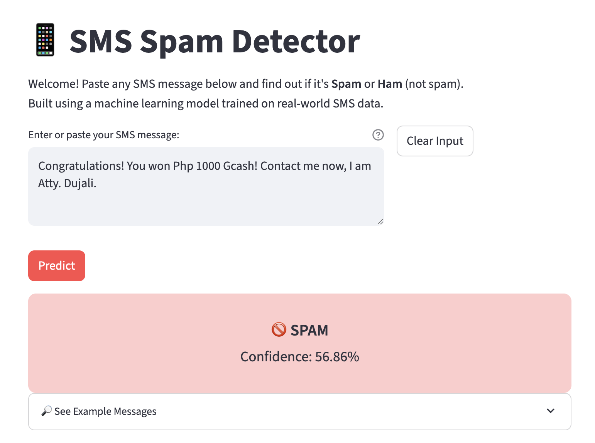

# SMS Spam Detector

A simple web app to detect SMS spam using a machine learning model, built with Streamlit.

## How to Run Locally

1. Create a virtual environment and activate it
2. Install requirements:
   pip install -r requirements.txt
3. Run the app:

## App Screenshot

